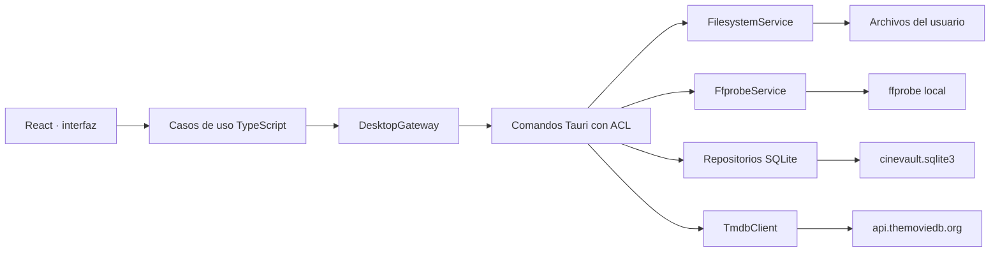

# Arquitectura de CineVault

Estado: aceptada para el hito 1  
Fecha: 2026-08-02

## Objetivo del hito

CineVault es una aplicación de escritorio local-first para catalogar archivos de vídeo, analizar su nombre y sus pistas, proponer un nombre profesional, ejecutar el cambio únicamente tras confirmación, registrar cada operación y deshacerla cuando siga siendo seguro.

El hito no incluye almacenamiento remoto, reproducción, remux ni transcodificación. Sí conserva límites de dominio para incorporarlos sin acoplar la aplicación a un proveedor.

## Principios

- El WebView nunca accede directamente al sistema de archivos, SQLite, procesos externos ni secretos.
- Toda mutación de archivos se valida otra vez en Rust en el momento de ejecutarse.
- Escanear y analizar son operaciones de lectura; nunca cambian el nombre de un archivo.
- SQLite separa la obra cinematográfica (`movies`) del archivo físico (`media_files`).
- Cada dato relevante conserva su fuente (`filename`, `ffprobe`, `tmdb`, `manual`) y una explicación auditable.
- La identificación es determinista. El contrato `MetadataResolver` permite añadir un resolvedor opcional futuro sin hacerlo obligatorio.
- El almacenamiento futuro se expresa con capacidades y estados del dominio, no con nombres de proveedores.

## Vista general



### Interfaz y aplicación (`src`)

- `app/`: shell, navegación, branding y composición de proveedores.
- `features/`: pantallas y estado por caso de uso (`import`, `library`, `history`, `settings`).
- `domain/`: parser tokenizado, generador de nombres, puntuación de coincidencia, validación de nombres Windows y contratos futuros. No importa React ni Tauri.
- `services/`: contrato `DesktopGateway`, adaptador Tauri y adaptador de desarrollo explícito.
- `components/`: piezas accesibles compartidas.
- `styles/`: tokens y estilos globales de la dirección visual premium inspirada en el minimalismo de Apple, adaptada a Windows.

La UI consume DTOs validados y deriva estado en render o en reducers; no duplica el estado de servidor en efectos. Las listas largas se virtualizan.

### Núcleo local (`src-tauri`)

- `commands/`: única frontera IPC; convierte errores de dominio en respuestas estructuradas.
- `database/`: conexión, migraciones y repositorios.
- `filesystem/`: descubrimiento, preflight, renombrado y deshacer.
- `media/`: ejecución y adaptación JSON de ffprobe.
- `services/`: orquestación de escaneo, importación, historial, ajustes y TMDb.
- `models/`: DTOs serializables; sin tipos de UI.

Las operaciones bloqueantes se desplazan fuera del hilo de interfaz. `ffprobe` se ejecuta como programa y argumentos separados, nunca mediante `cmd.exe` ni una cadena de shell.

## Flujos críticos

### Escaneo

1. El diálogo oficial devuelve una carpeta seleccionada por el usuario.
2. `scan_folder` valida que sea un directorio y recorre extensiones permitidas.
3. Se obtiene metadata de sistema; si ffprobe está disponible se analiza con timeout y salida limitada.
4. Cada archivo se inserta o actualiza por su ruta actual y se guardan streams en una transacción.
5. Rust emite progreso real por evento; un fallo de un archivo queda en su fila y no cancela el resto.
6. Rust clasifica el nombre original con reglas independientes, combina únicamente evidencias conocidas y genera la propuesta del escaneo. TypeScript refleja esas reglas para regenerar la previsualización al aplicar ajustes, una identificación TMDb o una edición explícita.

### Renombrado seguro

1. La UI exige selección explícita y confirmación con el recuento exacto.
2. Rust hace un preflight completo: archivo origen, directorio, caracteres/reservados Windows, extensión, longitud, duplicados del lote y destino existente con comparación sin distinguir mayúsculas.
3. Se persiste un plan `pending` con hash, fingerprint y un nombre temporal único para cada elemento antes de tocar archivos.
4. Bajo un mutex global, la fase A mueve cada origen a su temporal en el mismo directorio. La fase B mueve cada temporal al destino final. Esto resuelve ciclos y cambios de solo mayúsculas sin sobrescribir.
5. El journal se actualiza después de cada transición. Si falla una fase se intenta rollback en orden inverso; cada éxito o fallo de recuperación queda explícito.
6. No existe atomicidad real entre SQLite y NTFS. Un estado no inequívoco se marca `recovery_required`; el arranque lo vuelve a inspeccionar y nunca improvisa una sobrescritura.

### Deshacer

`undo_rename` solo está habilitado si el historial terminó correctamente, la ruta nueva existe y la ruta antigua está libre. Revalida todo en Rust, renombra, actualiza el archivo y marca `undone_at`. Nunca reemplaza un archivo existente.

## Datos

La migración inicial crea:

- `movies`: identidad y metadata editorial de una obra.
- `media_files`: identidad y ubicación del archivo; `movie_id` es opcional mientras no se identifique.
- `video_streams`, `audio_streams`, `subtitle_streams`: pistas técnicas con clave compuesta por archivo e índice.
- `chapters`: capítulos detectados.
- `movie_genres` y `movie_alternative_titles`: relaciones editoriales.
- `rename_batches` y `rename_history`: plan/journal de lote e ítems, incluidas rutas antigua, temporal y nueva, fingerprint, estado, error y fecha de deshacer.
- `metadata_values`: valor JSON, fuente, confianza y marca de corrección manual.
- `settings`: preferencias no secretas y el modo del proveedor de metadata.

SQLite usa claves foráneas, índices en rutas, TMDb ID, título/año, estado y fecha de historial. Las migraciones están versionadas, ordenadas y se ejecutan dentro de una transacción. La base reside en el directorio de datos de la aplicación, nunca junto a los vídeos.

### Estados extensibles

`storage_status` admite `local`, `cloud_only`, `local_and_cloud`, `uploading`, `downloading` y `unavailable`. El MVP solo escribe `local`.

```ts
interface StorageProvider {
  upload(request: UploadRequest): Promise<RemoteObject>;
  download(request: DownloadRequest): Promise<LocalObject>;
  delete(key: string): Promise<void>;
  exists(key: string): Promise<boolean>;
  getSignedUrl(key: string): Promise<string>;
  getMetadata(key: string): Promise<RemoteMetadata>;
}

type MediaLocation = "local" | "remote" | "cached" | "synchronizing" | "unavailable";
type PlaybackCapability = "directPlay" | "remux" | "transcode";
```

No existe implementación remota en este hito.

## Seguridad Tauri

- Ventana local `main`, sin orígenes remotos.
- CSP restrictiva; el único origen remoto permitido para imágenes es el CDN oficial de TMDb.
- Único plugin de frontend: diálogo con `dialog:allow-open`.
- Los comandos propios se declaran en `AppManifest::commands` y la capability concede solo los necesarios.
- No se instalan plugins genéricos de filesystem, shell, SQL ni HTTP.
- El token TMDb no usa prefijo `VITE_`, no se compila en el frontend y nunca se registra. El backend puede heredarlo del proceso mediante `TMDB_READ_ACCESS_TOKEN`; si se introduce en Ajustes se mantiene únicamente en memoria durante la sesión.

## Identificación y confianza

El parser conserva el nombre completo, tokeniza antes de clasificar y aplica reglas independientes por familia. Los datos de ffprobe prevalecen sobre inferencias técnicas del nombre; una corrección manual prevalece sobre ambos y queda marcada. TMDb aporta exclusivamente datos editoriales.

La puntuación es una suma explicable, no una probabilidad. El flujo real previo a elegir puntúa título localizado/original, similitud, año y ambigüedad; el dominio TypeScript también modela títulos alternativos, duración y correcciones previas para una ampliación posterior. Solo el nivel alto puede autoaplicarse y el umbral es configurable.

## Diseño visual

La dirección toma la claridad y contención del mejor software de consumo de Apple sin copiar la interfaz de macOS: composición silenciosa, jerarquía tipográfica precisa, superficies de carbón, profundidad sutil y controles generosamente redondeados. Paleta: Vault `#08090B`, Slate `#15171B`, Celluloid `#F5F5F7`, Patina `#78CEC2`, Cue `#D6AC72` y Splice `#FF7D87`. Se usan tipografías modernas incluidas en Windows (`Segoe UI Variable` y `Cascadia Mono`).

Se conserva la barra nativa de Windows. La ventana mínima es 1024×700; la navegación y las rejillas se adaptan al espacio disponible. Foco visible, estados con texto+icono, objetivos de al menos 40 px, `aria-live`, reducción de movimiento y operación completa por teclado son requisitos de aceptación.

## Observabilidad y errores

Rust registra eventos estructurados con nivel, operación y un identificador de lote o archivo, sin nombres completos en nivel `info` ni secretos. Los comandos devuelven `code`, `message`, `details` recuperables y `retryable`. La UI muestra errores por fila y un resumen persistente; un toast nunca es el único registro.

## Pruebas

- TypeScript: parser, reglas, combinación de fuentes, generador, puntuación y validación Windows con fixtures exigidos.
- Rust: fixtures de ffprobe, migraciones y repositorios.
- Integración Rust: escaneo, conflicto, rename, lote parcial y undo exclusivamente en `tempfile::TempDir`.
- UI: contrato del gateway de desarrollo, estados vacíos/error y build de producción.
- Entrega: `pnpm lint`, `pnpm test`, `pnpm build`, `cargo fmt --check`, `cargo clippy -- -D warnings` y `cargo test`.
