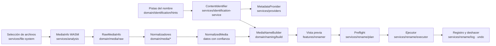

# Arquitectura

Estado: vigente
Fecha: 2026-08-16

Sustituye por completo a la versión anterior de este documento, que describía una aplicación Tauri 2
con Rust, SQLite y ffprobe inexistente en el repositorio.

## Qué es esto realmente

Una SPA de navegador (Vite + React 19 + TypeScript estricto). No hay servidor, ni proceso local, ni
base de datos. El acceso a disco es la File System Access API y el análisis multimedia es MediaInfo
compilado a WebAssembly.

## Cadena de responsabilidades



Reglas de dependencia:

- `domain/` es puro: no importa React, ni el DOM, ni `services/`. Se prueba con fixtures.
- `services/` conoce el navegador y a `domain/`, nunca a `features/`.
- `features/` compone la interfaz y no contiene reglas de negocio.

## Separación entre identificación y análisis técnico

Son dos mundos que no se mezclan:

- **`ContentIdentification`** (`domain/identification/types.ts`): título en España, título original,
  año, tipo, temporada, episodio, título del episodio, referencia del proveedor y puntuación.
- **`NormalizedMedia`** (`domain/media/types.ts`): general, pistas de vídeo, audio y subtítulos, y
  la fuente inferida.

El nombre del archivo puede alimentar la identificación (y se marca como inferido). **Nunca**
alimenta un dato técnico.

## Trazabilidad

`Traced<T>` (`domain/media/provenance.ts`) envuelve cada dato con `confidence` y `source`:

```ts
confirmed(3840, "VIDEO_STREAM_METADATA", "MediaInfo Width");
inferred("REMUX", "ORIGINAL_FILENAME", "Etiqueta REMUX en el nombre. No verificable.");
unknown<number>("VIDEO_STREAM_METADATA", "El stream no declara BitDepth");
userConfirmed("Dune Parte Dos", "Corrección manual");
```

`isUsableForName` es la puerta del generador: por defecto solo deja pasar `CONFIRMED` y
`USER_CONFIRMED`. La fuente pide explícitamente `allowInferred`, y la identificación usa `isKnown`
porque sin proveedor el nombre original es la única fuente posible.

## Decisiones técnicas relevantes

- **MediaInfo WASM y no ffprobe/FFmpeg.** En un navegador no se puede lanzar `ffprobe`, y
  `ffmpeg.wasm` supone decenas de megabytes para obtener menos información de contenedor. MediaInfo
  expone directamente `HDR_Format`, `HDR_Format_Compatibility`, `Format_Commercial_IfAny` y
  `Format_AdditionalFeatures`, que es exactamente lo que distingue Dolby Vision de HDR10, Atmos de
  TrueHD y DTS:X de DTS-HD MA.
- **Clasificación de calidad por clase de resolución.** Se decide por anchura y solo se corrige al
  alza si la altura indica una clase superior (contenido anamórfico). Así `3840×1608` es `4K UHD` y
  `1440×1080` es `Full HD`.
- **Proveedor abstracto.** `MetadataProvider` desacopla la aplicación de TMDb; `nullMetadataProvider`
  cubre el modo sin clave. Toda respuesta externa se valida con Zod y las URL de imagen se aceptan
  solo si encajan con el patrón de rutas de TMDb.
- **Renombrado sin copia.** El ejecutor solo llama a `move()`. La ruta «copiar y borrar» se eliminó
  por destructiva.
- **Puerto de sistema de archivos.** `RenameFileSystemPort` permite probar el lote completo, los
  conflictos y el deshacer con un sistema de archivos en memoria.

## Preparado para el futuro sin implementarlo

- El generador de nombres es un motor de plantillas con tokens: añadir campos no obliga a tocar la UI.
- `MetadataProvider` admite otro proveedor sin tocar el dominio.
- `NormalizedMedia` ya modela lo que necesitaría una biblioteca persistente (varias pistas, banderas,
  trazabilidad). No se ha añadido almacenamiento porque no está en el alcance.

## Límites deliberados

Sin biblioteca persistente, sin nube, sin reproducción, sin remux y sin transcodificación. La
herramienta analiza y renombra; no modifica el contenido de los archivos.
